# [📈 Live Status](https://status.cow.fi): <!--live status--> **🟩 All systems operational**

This repository contains the open-source uptime monitor and status page for [CoW Protocol](cow.fi), powered by [Upptime](https://github.com/upptime/upptime).

With [Upptime](https://upptime.js.org), you can get your own unlimited and free uptime monitor and status page, powered entirely by a GitHub repository. We use [Issues](https://github.com/cowprotocol/uptime/issues) as incident reports, [Actions](https://github.com/cowprotocol/uptime/actions) as uptime monitors, and [Pages](https://status.cow.fi) for the status page.

<!--start: status pages-->
<!-- This summary is generated by Upptime (https://github.com/upptime/upptime) -->
<!-- Do not edit this manually, your changes will be overwritten -->
<!-- prettier-ignore -->
| URL | Status | History | Response Time | Uptime |
| --- | ------ | ------- | ------------- | ------ |
|  [CoW Swap](https://swap.cow.fi/) | 🟩 Up | [co-w-swap.yml](https://github.com/cowprotocol/uptime/commits/HEAD/history/co-w-swap.yml) | 

 92ms
     
 | 

<a href="https://status.cow.fi/history/co-w-swap">100.00%</a>
    

|  [Explorer](http://explorer.cow.fi) | 🟩 Up | [explorer.yml](https://github.com/cowprotocol/uptime/commits/HEAD/history/explorer.yml) | 

 126ms
     
 | 

<a href="https://status.cow.fi/history/explorer">100.00%</a>
    

|  [CoW Swap - Barn](https://barn.cow.fi/) | 🟩 Up | [co-w-swap-barn.yml](https://github.com/cowprotocol/uptime/commits/HEAD/history/co-w-swap-barn.yml) | 

 128ms
     
 | 

<a href="https://status.cow.fi/history/co-w-swap-barn">100.00%</a>
    

|  [CoW Swap - Widget](https://widget.cow.fi) | 🟩 Up | [co-w-swap-widget.yml](https://github.com/cowprotocol/uptime/commits/HEAD/history/co-w-swap-widget.yml) | 

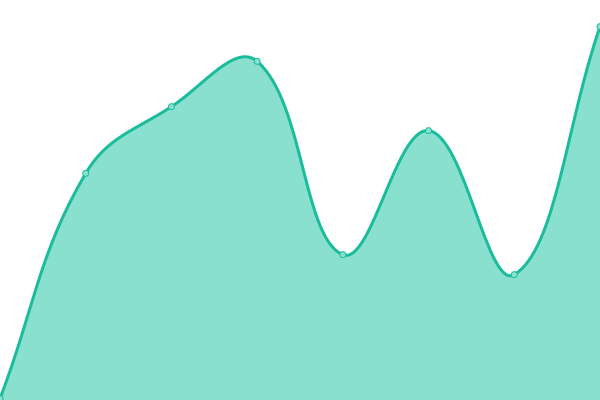 108ms
     
 | 

<a href="https://status.cow.fi/history/co-w-swap-widget">100.00%</a>
    

|  [Explorer - Barn](https://barn.explorer.cow.fi) | 🟩 Up | [explorer-barn.yml](https://github.com/cowprotocol/uptime/commits/HEAD/history/explorer-barn.yml) | 

 110ms
     
 | 

<a href="https://status.cow.fi/history/explorer-barn">100.00%</a>
    

|  [CoW Protocol](https://cow.fi) | 🟩 Up | [co-w-protocol.yml](https://github.com/cowprotocol/uptime/commits/HEAD/history/co-w-protocol.yml) | 

 255ms
     
 | 

<a href="https://status.cow.fi/history/co-w-protocol">100.00%</a>
    

|  [CoW Protocol - Docs](https://docs.cow.fi) | 🟩 Up | [co-w-protocol-docs.yml](https://github.com/cowprotocol/uptime/commits/HEAD/history/co-w-protocol-docs.yml) | 

 101ms
     
 | 

<a href="https://status.cow.fi/history/co-w-protocol-docs">100.00%</a>
    

|  [CoW Protocol - Learn](https://learn.cow.fi) | 🟩 Up | [co-w-protocol-learn.yml](https://github.com/cowprotocol/uptime/commits/HEAD/history/co-w-protocol-learn.yml) | 

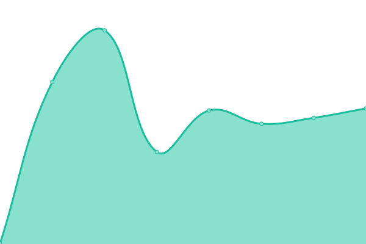 256ms
     
 | 

<a href="https://status.cow.fi/history/co-w-protocol-learn">100.00%</a>
    

|  [MEV Blocker](https://mevblocker.io/) | 🟩 Up | [mev-blocker.yml](https://github.com/cowprotocol/uptime/commits/HEAD/history/mev-blocker.yml) | 

 280ms
     
 | 

<a href="https://status.cow.fi/history/mev-blocker">100.00%</a>
    

|  [CoW Swap Token List](https://files.cow.fi/tokens/CowSwap.json) | 🟩 Up | [co-w-swap-token-list.yml](https://github.com/cowprotocol/uptime/commits/HEAD/history/co-w-swap-token-list.yml) | 

 84ms
     
 | 

<a href="https://status.cow.fi/history/co-w-swap-token-list">100.00%</a>
    

|  [Quote API Mainnet](https://api.cow.fi/mainnet/api/v1/quote) | 🟩 Up | [quote-api-mainnet.yml](https://github.com/cowprotocol/uptime/commits/HEAD/history/quote-api-mainnet.yml) | 

 2442ms
     
 | 

<a href="https://status.cow.fi/history/quote-api-mainnet">100.00%</a>
    

|  [Quote API Gnosis Chain](https://api.cow.fi/xdai/api/v1/quote) | 🟩 Up | [quote-api-gnosis-chain.yml](https://github.com/cowprotocol/uptime/commits/HEAD/history/quote-api-gnosis-chain.yml) | 

 2594ms
     
 | 

<a href="https://status.cow.fi/history/quote-api-gnosis-chain">100.00%</a>
    

|  [Quote API Arbitrum One](https://api.cow.fi/arbitrum_one/api/v1/quote) | 🟩 Up | [quote-api-arbitrum-one.yml](https://github.com/cowprotocol/uptime/commits/HEAD/history/quote-api-arbitrum-one.yml) | 

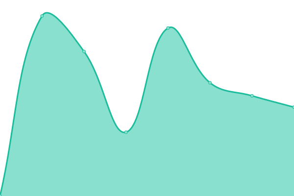 1744ms
     
 | 

<a href="https://status.cow.fi/history/quote-api-arbitrum-one">100.00%</a>
    

|  [Quote API Base](https://api.cow.fi/base/api/v1/quote) | 🟩 Up | [quote-api-base.yml](https://github.com/cowprotocol/uptime/commits/HEAD/history/quote-api-base.yml) | 

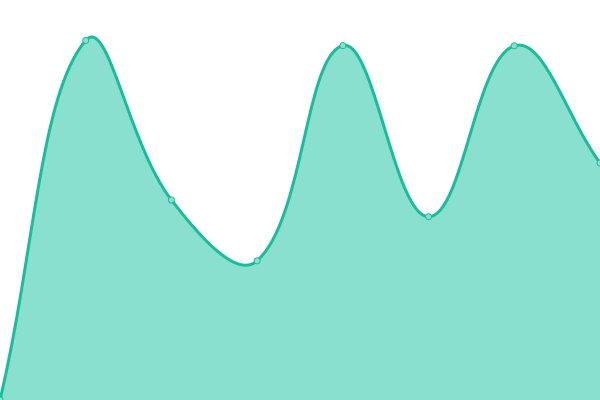 1466ms
     
 | 

<a href="https://status.cow.fi/history/quote-api-base">100.00%</a>
    

|  [Quote API Avalanche](https://api.cow.fi/avalanche/api/v1/quote) | 🟩 Up | [quote-api-avalanche.yml](https://github.com/cowprotocol/uptime/commits/HEAD/history/quote-api-avalanche.yml) | 

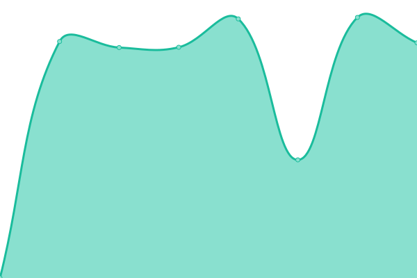 2213ms
     
 | 

<a href="https://status.cow.fi/history/quote-api-avalanche">100.00%</a>
    

|  [Quote API Polygon](https://api.cow.fi/polygon/api/v1/quote) | 🟩 Up | [quote-api-polygon.yml](https://github.com/cowprotocol/uptime/commits/HEAD/history/quote-api-polygon.yml) | 

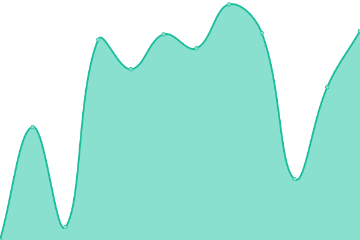 2271ms
     
 | 

<a href="https://status.cow.fi/history/quote-api-polygon">100.00%</a>
    

|  [Quote API Lens](https://api.cow.fi/lens/api/v1/quote) | 🟩 Up | [quote-api-lens.yml](https://github.com/cowprotocol/uptime/commits/HEAD/history/quote-api-lens.yml) | 

 255ms
     
 | 

<a href="https://status.cow.fi/history/quote-api-lens">100.00%</a>
    

|  [Quote API BNB](https://api.cow.fi/bnb/api/v1/quote) | 🟩 Up | [quote-api-bnb.yml](https://github.com/cowprotocol/uptime/commits/HEAD/history/quote-api-bnb.yml) | 

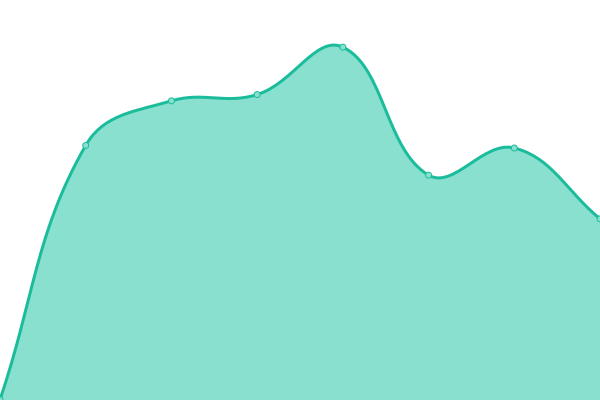 896ms
     
 | 

<a href="https://status.cow.fi/history/quote-api-bnb">100.00%</a>
    

|  [Quote API LINEA](https://api.cow.fi/linea/api/v1/quote) | 🟩 Up | [quote-api-linea.yml](https://github.com/cowprotocol/uptime/commits/HEAD/history/quote-api-linea.yml) | 

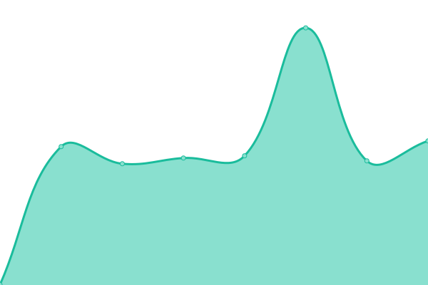 383ms
     
 | 

<a href="https://status.cow.fi/history/quote-api-linea">100.00%</a>
    

|  [Quote API Ink](https://api.cow.fi/ink/api/v1/quote) | 🟩 Up | [quote-api-ink.yml](https://github.com/cowprotocol/uptime/commits/HEAD/history/quote-api-ink.yml) | 

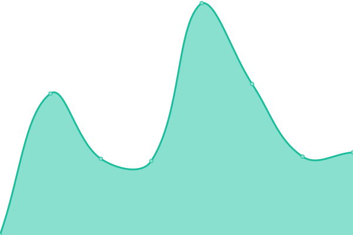 650ms
     
 | 

<a href="https://status.cow.fi/history/quote-api-ink">100.00%</a>
    

|  [BFF - Slippage Tolerance (mainnet)](https://bff.cow.fi/1/markets/0xDEf1CA1fb7FBcDC777520aa7f396b4E015F497aB-0xC02aaA39b223FE8D0A0e5C4F27eAD9083C756Cc2/slippageTolerance) | 🟩 Up | [bff-slippage-tolerance-mainnet.yml](https://github.com/cowprotocol/uptime/commits/HEAD/history/bff-slippage-tolerance-mainnet.yml) | 

 166ms
     
 | 

<a href="https://status.cow.fi/history/bff-slippage-tolerance-mainnet">100.00%</a>
    

|  [BFF - Slippage Tolerance (Gnosis Chain)](https://bff.cow.fi/100/markets/0x177127622c4a00f3d409b75571e12cb3c8973d3c-0xe91D153E0b41518A2Ce8Dd3D7944Fa863463a97d/slippageTolerance) | 🟩 Up | [bff-slippage-tolerance-gnosis-chain.yml](https://github.com/cowprotocol/uptime/commits/HEAD/history/bff-slippage-tolerance-gnosis-chain.yml) | 

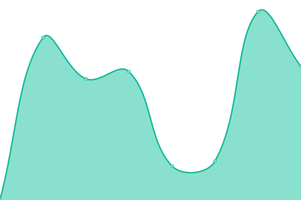 376ms
     
 | 

<a href="https://status.cow.fi/history/bff-slippage-tolerance-gnosis-chain">100.00%</a>
    

|  [BFF - Slippage Tolerance (Arbitrum One)](https://bff.cow.fi/42161/markets/0xcb8b5cd20bdcaea9a010ac1f8d835824f5c87a04-0x82aF49447D8a07e3bd95BD0d56f35241523fBab1/slippageTolerance) | 🟩 Up | [bff-slippage-tolerance-arbitrum-one.yml](https://github.com/cowprotocol/uptime/commits/HEAD/history/bff-slippage-tolerance-arbitrum-one.yml) | 

 329ms
     
 | 

<a href="https://status.cow.fi/history/bff-slippage-tolerance-arbitrum-one">100.00%</a>
    

|  [BFF - Slippage Tolerance (Base)](https://bff.cow.fi/8453/markets/0xc694a91e6b071bF030A18BD3053A7fE09B6DaE69-0x4200000000000000000000000000000000000006/slippageTolerance) | 🟩 Up | [bff-slippage-tolerance-base.yml](https://github.com/cowprotocol/uptime/commits/HEAD/history/bff-slippage-tolerance-base.yml) | 

 364ms
     
 | 

<a href="https://status.cow.fi/history/bff-slippage-tolerance-base">100.00%</a>
    

|  [BFF - Slippage Tolerance (Avalanche)](https://bff.cow.fi/43114/markets/0x9702230a8ea53601f5cd2dc00fdbc13d4df4a8c7-0xb31f66aa3c1e785363f0875a1b74e27b85fd66c7/slippageTolerance) | 🟩 Up | [bff-slippage-tolerance-avalanche.yml](https://github.com/cowprotocol/uptime/commits/HEAD/history/bff-slippage-tolerance-avalanche.yml) | 

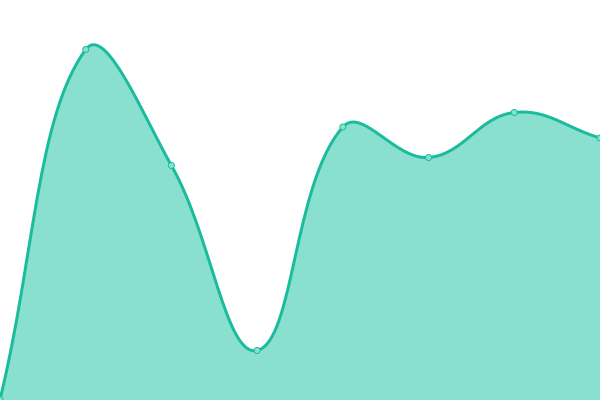 519ms
     
 | 

<a href="https://status.cow.fi/history/bff-slippage-tolerance-avalanche">100.00%</a>
    

|  [BFF - Slippage Tolerance (Polygon)](https://bff.cow.fi/137/markets/0x8f3Cf7ad23Cd3CaDbD9735AFf958023239c6A063-0x0d500b1d8e8ef31e21c99d1db9a6444d3adf1270/slippageTolerance) | 🟩 Up | [bff-slippage-tolerance-polygon.yml](https://github.com/cowprotocol/uptime/commits/HEAD/history/bff-slippage-tolerance-polygon.yml) | 

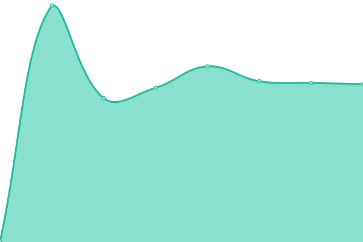 366ms
     
 | 

<a href="https://status.cow.fi/history/bff-slippage-tolerance-polygon">100.00%</a>
    

|  [BFF - USD Price (mainnet)](https://bff.cow.fi/1/tokens/0xc02aaa39b223fe8d0a0e5c4f27ead9083c756cc2/usdPrice) | 🟩 Up | [bff-usd-price-mainnet.yml](https://github.com/cowprotocol/uptime/commits/HEAD/history/bff-usd-price-mainnet.yml) | 

 21ms
     
 | 

<a href="https://status.cow.fi/history/bff-usd-price-mainnet">100.00%</a>
    

|  [BFF - USD Price (Gnosis Chain)](https://bff.cow.fi/100/tokens/0xe91D153E0b41518A2Ce8Dd3D7944Fa863463a97d/usdPrice) | 🟩 Up | [bff-usd-price-gnosis-chain.yml](https://github.com/cowprotocol/uptime/commits/HEAD/history/bff-usd-price-gnosis-chain.yml) | 

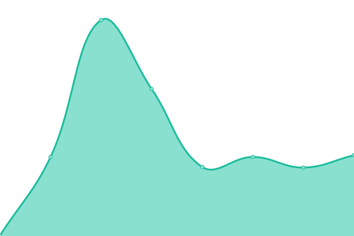 82ms
     
 | 

<a href="https://status.cow.fi/history/bff-usd-price-gnosis-chain">100.00%</a>
    

|  [BFF - USD Price (Arbitrum One)](https://bff.cow.fi/42161/tokens/0x82aF49447D8a07e3bd95BD0d56f35241523fBab1/usdPrice) | 🟩 Up | [bff-usd-price-arbitrum-one.yml](https://github.com/cowprotocol/uptime/commits/HEAD/history/bff-usd-price-arbitrum-one.yml) | 

 15ms
     
 | 

<a href="https://status.cow.fi/history/bff-usd-price-arbitrum-one">100.00%</a>
    

|  [BFF - USD Price (Base)](https://bff.cow.fi/8453/tokens/0x4200000000000000000000000000000000000006/usdPrice) | 🟩 Up | [bff-usd-price-base.yml](https://github.com/cowprotocol/uptime/commits/HEAD/history/bff-usd-price-base.yml) | 

 17ms
     
 | 

<a href="https://status.cow.fi/history/bff-usd-price-base">100.00%</a>
    

|  [BFF - USD Price (Avalanche)](https://bff.cow.fi/43114/tokens/0xb31f66aa3c1e785363f0875a1b74e27b85fd66c7/usdPrice) | 🟩 Up | [bff-usd-price-avalanche.yml](https://github.com/cowprotocol/uptime/commits/HEAD/history/bff-usd-price-avalanche.yml) | 

 19ms
     
 | 

<a href="https://status.cow.fi/history/bff-usd-price-avalanche">100.00%</a>
    

|  [BFF - USD Price (Polygon)](https://bff.cow.fi/137/tokens/0x0d500b1d8e8ef31e21c99d1db9a6444d3adf1270/usdPrice) | 🟩 Up | [bff-usd-price-polygon.yml](https://github.com/cowprotocol/uptime/commits/HEAD/history/bff-usd-price-polygon.yml) | 

 21ms
     
 | 

<a href="https://status.cow.fi/history/bff-usd-price-polygon">100.00%</a>
    

<!--end: status pages-->

[**Visit our status website →**](https://status.cow.fi)

## 📄 License

- Powered by: [Upptime](https://github.com/upptime/upptime)
- Code: [MIT](./LICENSE) © [CoW Protocol](cow.fi)
- Data in the `./history` directory: [Open Database License](https://opendatacommons.org/licenses/odbl/1-0/)
