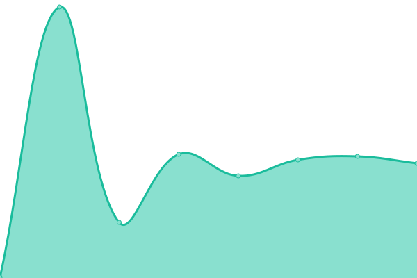
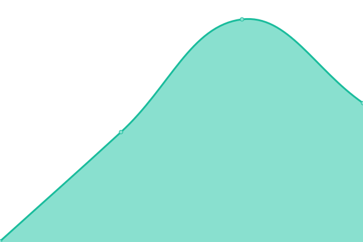
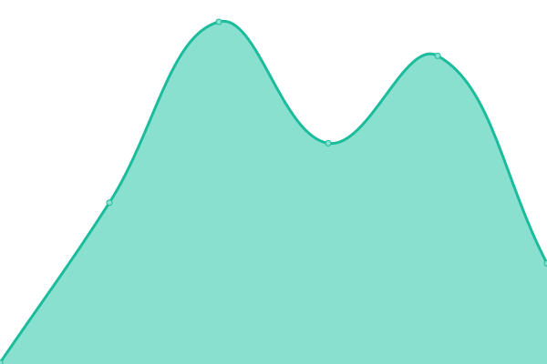
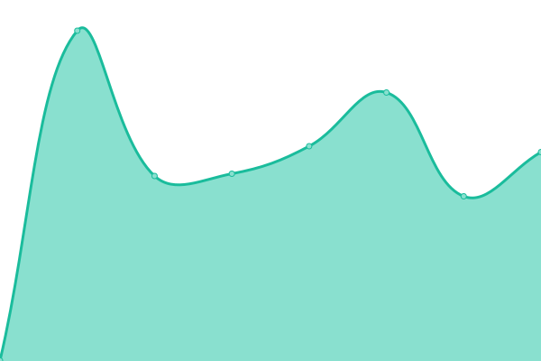
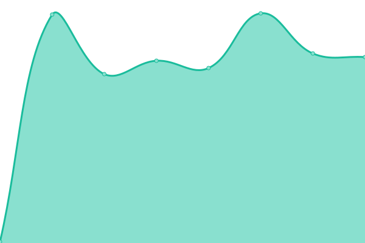
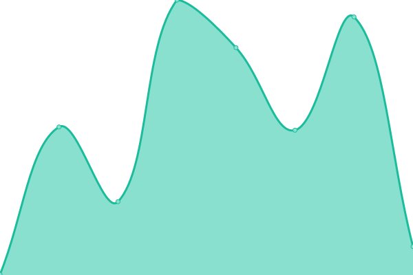
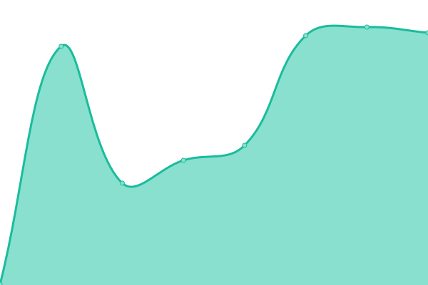
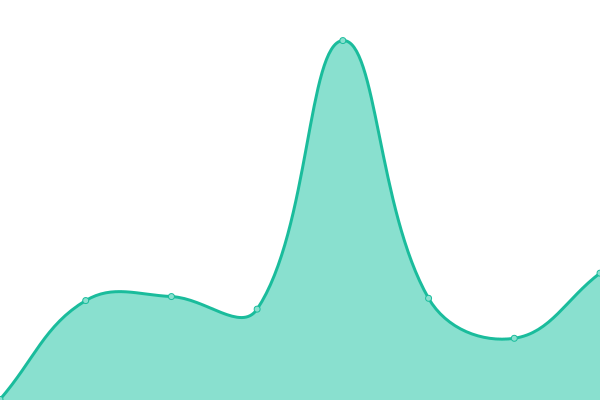
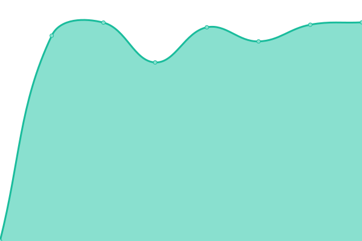

# [📈 Live Status](https://status.cow.fi): <!--live status--> **🟩 All systems operational**

This repository contains the open-source uptime monitor and status page for [CoW Protocol](cow.fi), powered by [Upptime](https://github.com/upptime/upptime).

With [Upptime](https://upptime.js.org), you can get your own unlimited and free uptime monitor and status page, powered entirely by a GitHub repository. We use [Issues](https://github.com/cowprotocol/uptime/issues) as incident reports, [Actions](https://github.com/cowprotocol/uptime/actions) as uptime monitors, and [Pages](https://status.cow.fi) for the status page.

<!--start: status pages-->
<!-- This summary is generated by Upptime (https://github.com/upptime/upptime) -->
<!-- Do not edit this manually, your changes will be overwritten -->
<!-- prettier-ignore -->
| URL | Status | History | Response Time | Uptime |
| --- | ------ | ------- | ------------- | ------ |
|  [CoW Swap](https://swap.cow.fi/) | 🟩 Up | [co-w-swap.yml](https://github.com/cowprotocol/uptime/commits/HEAD/history/co-w-swap.yml) | 

 251ms
     
 | 

<a href="https://status.cow.fi/history/co-w-swap">100.00%</a>
    

|  [Explorer](http://explorer.cow.fi) | 🟩 Up | [explorer.yml](https://github.com/cowprotocol/uptime/commits/HEAD/history/explorer.yml) | 

 231ms
     
 | 

<a href="https://status.cow.fi/history/explorer">100.00%</a>
    

|  [CoW Swap - Barn](https://barn.cow.fi/) | 🟩 Up | [co-w-swap-barn.yml](https://github.com/cowprotocol/uptime/commits/HEAD/history/co-w-swap-barn.yml) | 

 178ms
     
 | 

<a href="https://status.cow.fi/history/co-w-swap-barn">100.00%</a>
    

|  [Explorer - Barn](https://barn.explorer.cow.fi) | 🟩 Up | [explorer-barn.yml](https://github.com/cowprotocol/uptime/commits/HEAD/history/explorer-barn.yml) | 

 223ms
     
 | 

<a href="https://status.cow.fi/history/explorer-barn">100.00%</a>
    

|  [CoW Protocol](https://cow.fi) | 🟩 Up | [co-w-protocol.yml](https://github.com/cowprotocol/uptime/commits/HEAD/history/co-w-protocol.yml) | 

 213ms
     
 | 

<a href="https://status.cow.fi/history/co-w-protocol">100.00%</a>
    

|  [CoW Protocol - Docs](https://docs.cow.fi) | 🟩 Up | [co-w-protocol-docs.yml](https://github.com/cowprotocol/uptime/commits/HEAD/history/co-w-protocol-docs.yml) | 

 174ms
     
 | 

<a href="https://status.cow.fi/history/co-w-protocol-docs">100.00%</a>
    

|  [CoW Grants](https://grants.cow.fi/) | 🟩 Up | [co-w-grants.yml](https://github.com/cowprotocol/uptime/commits/HEAD/history/co-w-grants.yml) | 

 488ms
     
 | 

<a href="https://status.cow.fi/history/co-w-grants">100.00%</a>
    

|  [MEV Blocker](https://mevblocker.io/) | 🟩 Up | [mev-blocker.yml](https://github.com/cowprotocol/uptime/commits/HEAD/history/mev-blocker.yml) | 

 262ms
     
 | 

<a href="https://status.cow.fi/history/mev-blocker">100.00%</a>
    

|  [CoW Swap Token List](https://files.cow.fi/tokens/CowSwap.json) | 🟩 Up | [co-w-swap-token-list.yml](https://github.com/cowprotocol/uptime/commits/HEAD/history/co-w-swap-token-list.yml) | 

 84ms
     
 | 

<a href="https://status.cow.fi/history/co-w-swap-token-list">100.00%</a>
    

|  [Quote API](https://api.cow.fi/mainnet/api/v1/quote) | 🟩 Up | [quote-api.yml](https://github.com/cowprotocol/uptime/commits/HEAD/history/quote-api.yml) | 

 1497ms
     
 | 

<a href="https://status.cow.fi/history/quote-api">100.00%</a>
    

<!--end: status pages-->

[**Visit our status website →**](https://status.cow.fi)

## 📄 License

- Powered by: [Upptime](https://github.com/upptime/upptime)
- Code: [MIT](./LICENSE) © [CoW Protocol](cow.fi)
- Data in the `./history` directory: [Open Database License](https://opendatacommons.org/licenses/odbl/1-0/)
